# :tophat: Mandrake

> **Currently this a mirror of my local work on other DVCS** | to update: `git push github master`

Mandrake is an application generator for Clever-Cloud:

- it helps you with providing walking skeletons of web applications or addon
- and with creating and pushing your application on Clever-Cloud for the first-time
- when you'll feel confident, you'll be able to add your own templates of creation

> WIP

Currently, Mandrake doesn't run on Windows (but WIP)

## prerequisites

You have to install the Clever-Cloud CLI: https://www.clever-cloud.com/doc/clever-tools/getting_started/

## Install

- `git clone` this repository
- `cd mandrake`
- `npm install`
- `npm link`

*Tips*: to remove the link: `open /usr/local/bin/` and remove the link

## Use

**mandrake** comes with several default templates (see the `/templates` directory). Here, this is a tutorial on how to use some of these generators to create a microservices architecture:

### Vert-x discoverable microservice

I want to create a microservices architecture with Vert.x, Scala and Redis.

I'm going to create:

- a redis Clever-Cloud addon, because I use the [Redis Vert.x Discovery Backend](http://vertx.io/docs/vertx-service-discovery-backend-redis/java/)
- a Vert.x microservice
- a Vert.x web application to call the microservice

#### Initialization

So, first, create a directory (and go inside), and launch **mandrake**:

```shell
mkdir microservices-demo
cd microservices-demo
mandrake
```

The first time you run **mandrake** in an empty directory, **mandrake** copies the default templates in the current directory...

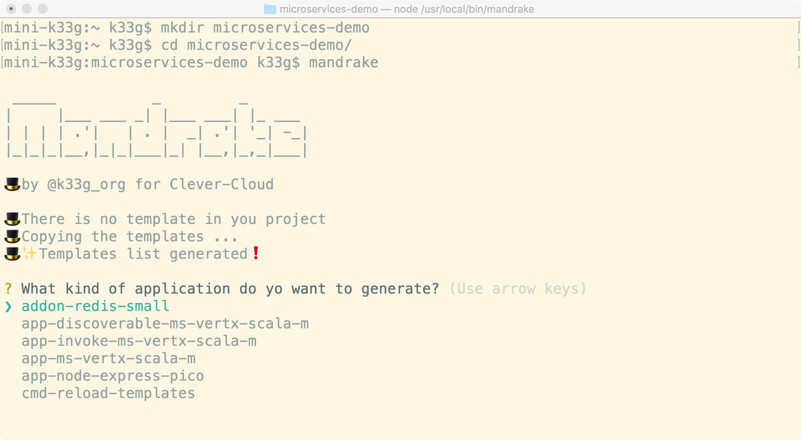

... And **mandrake** creates a small database to keep project informations

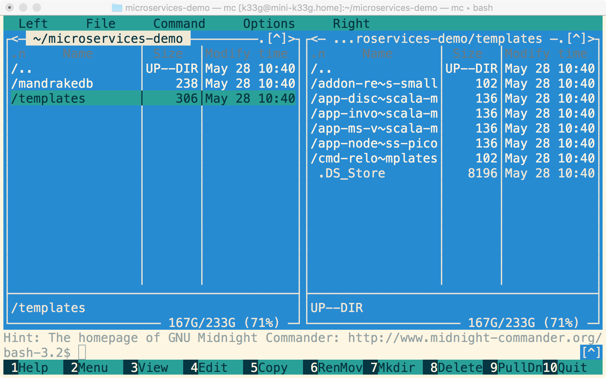

#### Redis Addon

Select the `addon-redis-small` (**mandrake** will create and deploy a "small" redis database on Clever-Cloud)

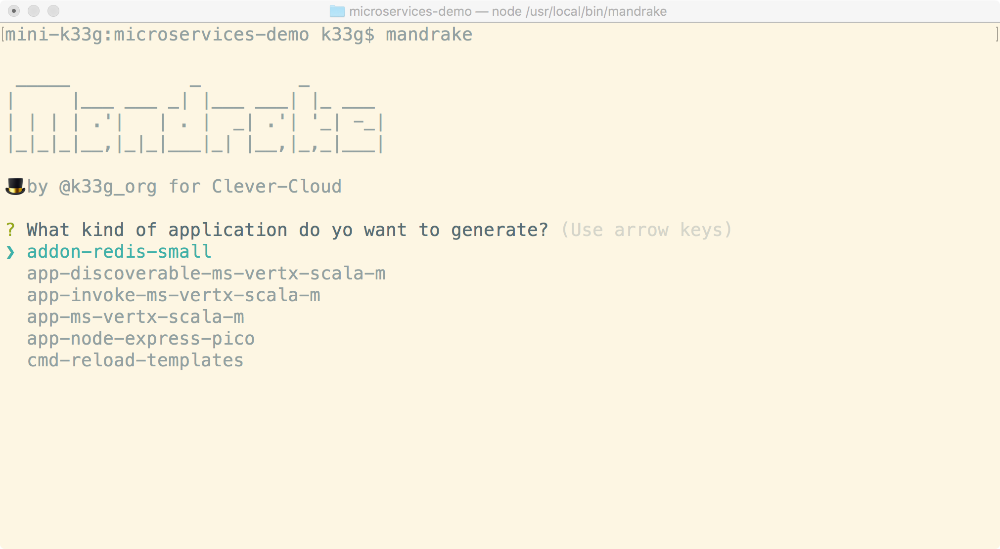

Explain:
- where you want to deploy the redis database
- type the name of your organization on Clever-Cloud
- give a name to your addon and type `enter`

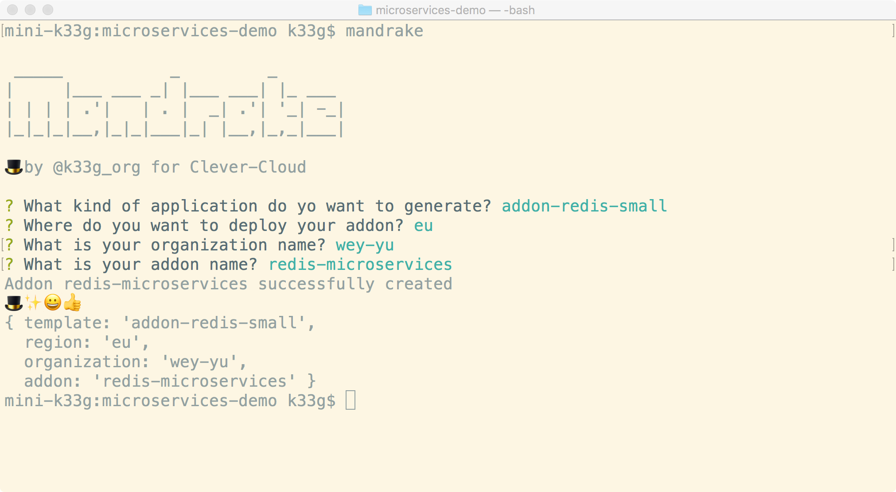

#### Microservice application

Run **mandrake** again, and choose the `app-discoverable-ms-vertx-scala-m` item (**mandrake** will create and deploy a scala application on an sized "M" instance on Clever-Cloud)

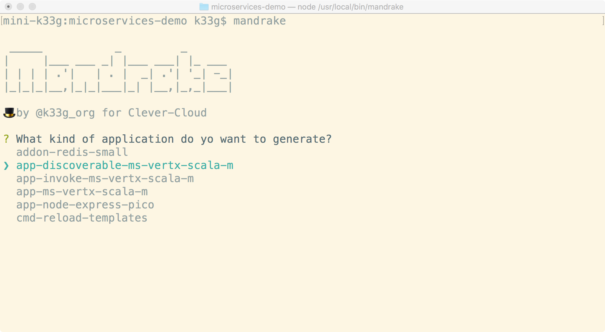

Then, explain:
- where you want to deploy the microservice
- type the name of your organization on Clever-Cloud
- give a name to your project
- give a display name
- give a domain name
- give a name to the main scala file (the source code and the project structure will be generated by **mandrake**)
- give an id for the microservice (it will be registered with it)
- type the name of the previous redis addon and type `enter`

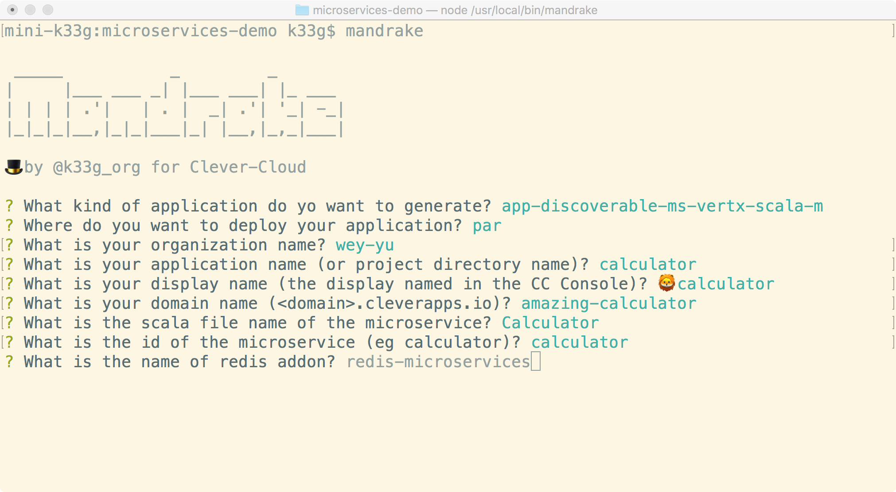

So, **mandrake** will create the git repository, the project structure and deploy it to Clever-Cloud

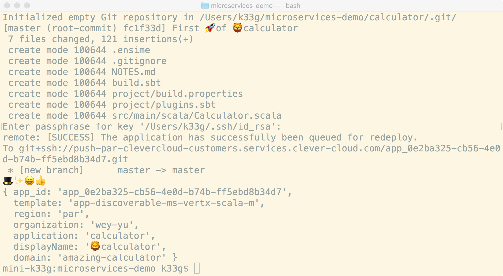

You can check that the application and the addon have been created and deployed to Clever-Cloud:

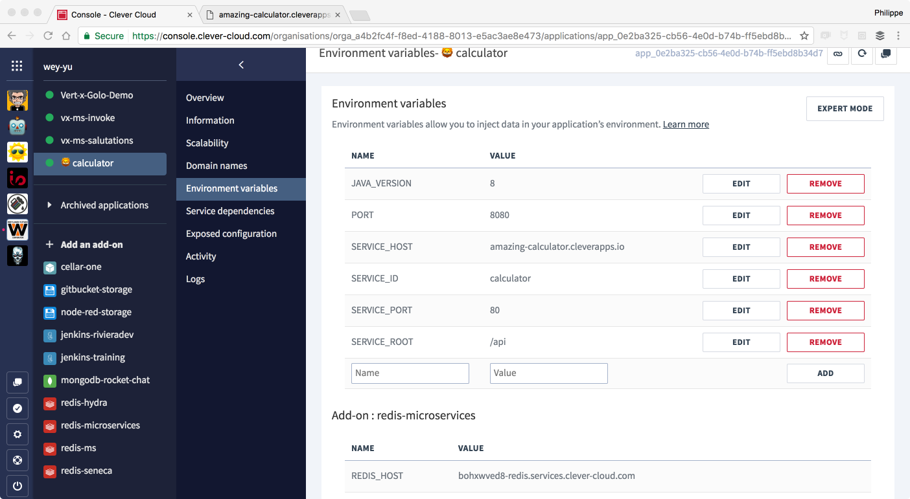

And this is the generated code:

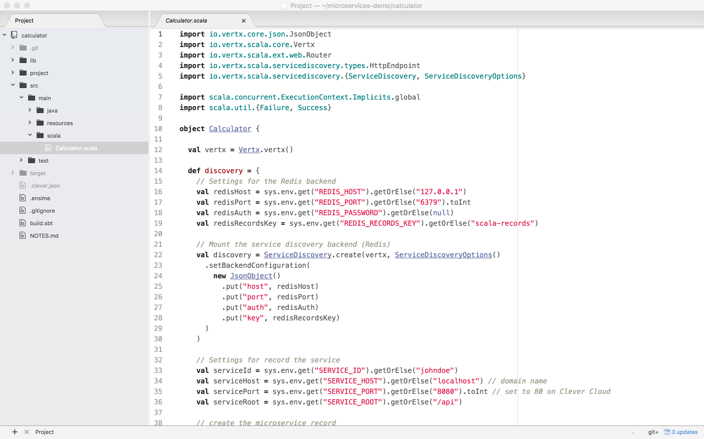

Once the microservice deployed, you can check the redis database:

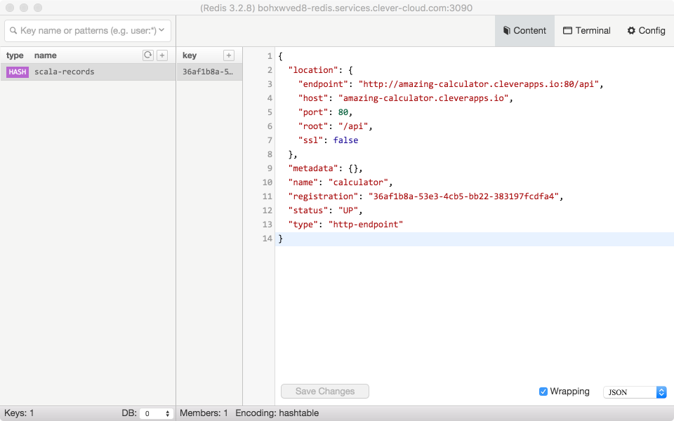

And try the operations of the microservice:

- http://amazing-calculator.cleverapps.io/api/add/38/4
- http://amazing-calculator.cleverapps.io/api/multiply/21/2

Now, it's time to create the code to use this microservice.

#### Web application to "call" the microservice

There is a template generator for this too.

Run **mandrake** again, and choose the `app-invoke-ms-vertx-scala-m` item (**mandrake** will create and deploy a scala application on an sized "M" instance on Clever-Cloud)

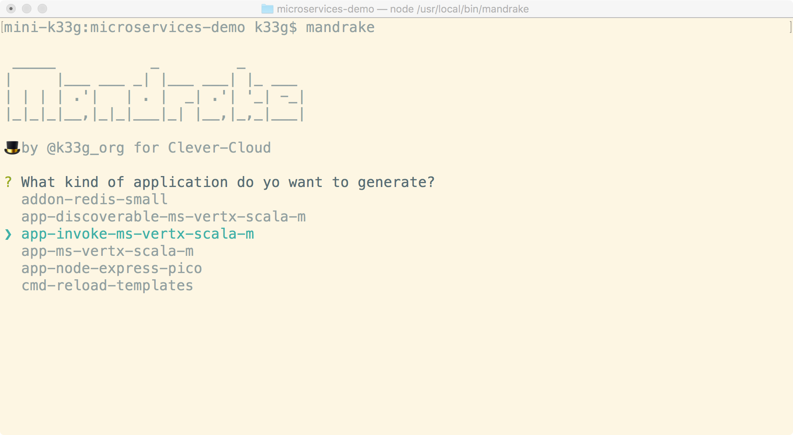

Then, explain:
- where you want to deploy the microservice
- type the name of your organization on Clever-Cloud
- give a name to your project
- give a display name
- give a domain name
- give a name to the main scala file (the source code and the project structure will be generated by **mandrake**)
- give the id of the microservice to call
- type the name of the previous redis addon and type `enter`

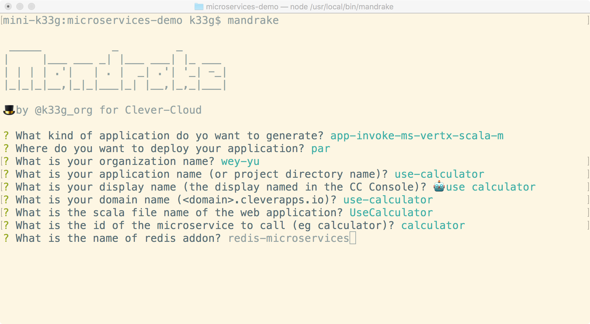

So, **mandrake** will create the git repository, the project structure and deploy it to Clever-Cloud

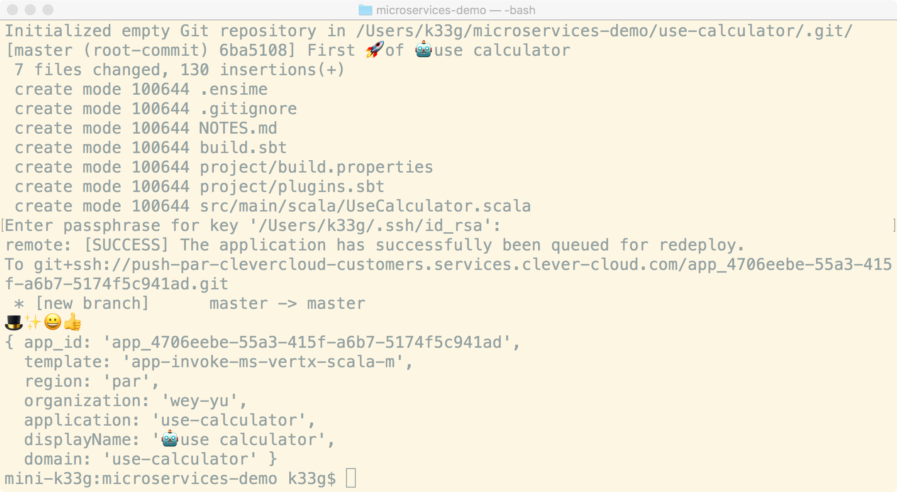

You can check that the application has been created and deployed to Clever-Cloud:

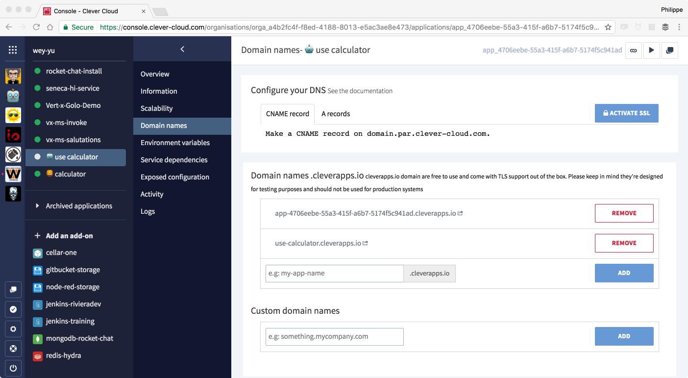

And this is the generated code:

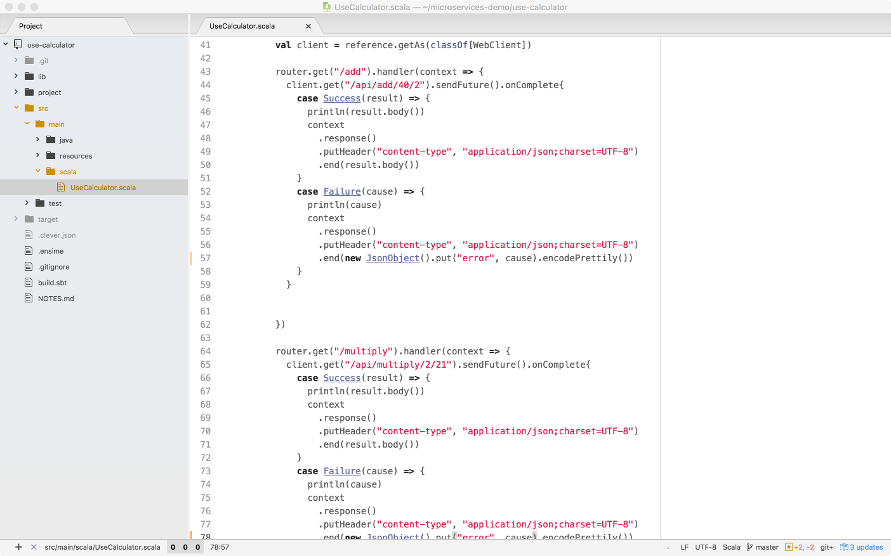

Now you can call the two demo routes of the web application:

- http://use-calculator.cleverapps.io/add
- http://use-calculator.cleverapps.io/multiply

That's all! :v:

Now each time you update a project, you just have to do this to deploy again:

```shell
git add .
git commit -m "my new killer feature"
git push clever master # if you want to deploy the master branch
```


## Create a template

> WIP

### Application template

>> WIP

### Addon template

>> WIP

### Command template

>> WIP

## Roadmap

> WIP
